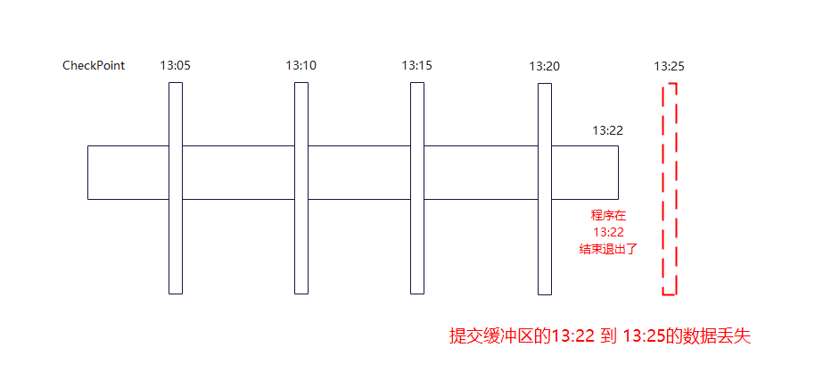
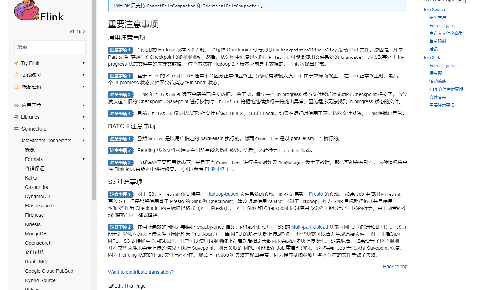

# 综述背景

在工作有一个临时的需求，需要将hive的数据（包含历史数据，大约有40多亿，按天分区存储）读出来进行分词后，将结果按分区写入另一张表中。

1. 读取一个hive的表 table_source 大约有40亿多数据（500GB+），表中有个字段是个句子。
2. 进行分词处理，一个句子可能会分成多个词语（规定每个句子分词取前3个词语）。
3. 将分词的结果写入另外一张表 table_result 中，大约可能有 120亿 数据

本文档不对分词进行介绍，详情可以参考：[jieba分词](https://github.com/fxsjy/jieba)

# 初步思路

因为数据量巨大，使用hive的udf，自己写java程序（不利用分布式框架）等，基本被排除。

## 思路一 使用Fink Batch模式

### 大致方案

1. 开启Flink批处理模式
2. Flink 读取hive数据

2. 进行分词的map处理
3. 利用Flink写回hive。

### 相关问题

因为数据量巨大，Flink的批处理模式是将所有数据一个一个算子处理。目前有个三个算子：

1. 读取hive数据 算子
2. 分词处理 算子
3. 结果数据写回到hive 算子

意味着Flink在第一个读取算子时需要将所有的数据读入后才会进行第二个算子，第一个算子读取40亿数据后才会开启第二个算子，这个压力可想而知，如果使用flink 批处理模式进行处理，40亿的数据可能运行时间超过 一周，这个是不可取的。


## 思路二 使用Flink 流式处理 

### 大致方案

1. 使用Flink流式处理
2. Flink 读取hive数据

2. 进行分词的map处理
3. 利用Flink写回hive。

跟方案一的批处理模式不同的是：每个算子不会一次处理所有的数据，而是一批一批处理（具体看设置的读取flink的并行度和每次读取多少数据量），这样在程序启动后，所有算子同时处理数据。40亿数据一批一批流过所有的算子，效率比海量处理更高一些。

### 相关问题

流式处理 没有 批处理 阻塞时处理的弊端，但是 利用flink写hive的话基本都是利用以下方式：

```java
dataStream.process(new MessageProcessFunction()).setParallelism(4).name("fenci-function");
Table keywordProcessTable = tableEnv.fromDataStream(process);
String hiveSql = "insert into table_result SELECT aid,bid,cId,key_word ds FROM %s";
String sqlProcess = String.format(hiveSql, keywordProcessTable);
tableEnv.executeSql(sqlProcess);
```

这是Flink tableAPI中 插入数据的方式，也是推荐的方式，底层是类似 直接写 *hdfs数据+hive元数据* 的方式直接写入hive数据，而不是传统的Sink。

但是使用 这种API，写入hive时，是现将数据缓存到提交区，等待一个**触发时机**后批量写入hive，这个**触发时机**就是 flink checkpoint ，这就需要程序开启checkpoint。


**最不幸的事情发生了**：我们当前使用的flink版本是1.14.4，flink在流式处理模式下，读取hive数据，hive数据是个有界流（本身总有读完的时候），当数据的source读取完之后，source会停止，程序依次处理完然后停止。但是当程序停止退出前没有触发 hive写数据的checkpoint，但是最后一批hive提交区的数据没有真正写入到 hive 上（hdfs上数据是 .uncomXXX 的未合并状态，还有一些数据在flink程序的提交缓冲区）。


就导致 flink 最后一个checkpoint 到程序退出前的数据丢失在flink的提交缓冲区。



经过查找资料后发现：Flink 中文社区官微 曾经在FLIP-147 进行过修复 可以参考 [FLIP-147：支持包含结束任务的 Checkpoint 操作与作业结束流程修正](https://mp.weixin.qq.com/s?__biz=MzU3Mzg4OTMyNQ==&mid=2247498786&idx=1&sn=6b3664ff103410c2f0828967980105fa&chksm=fd387260ca4ffb7698b4943ad9d6616166b6e3c9c2d75d268626b9ce746f056f2c1bda5b9f9a&scene=27)

依照官方的说法，这个问题已经修复。

同时在官方文档上找到相关的其他说明，可以配置在结束任务前进行一次Checkpoint，代码如下：

```java
// enable checkpointing with finished tasks
Configuration config = new Configuration();
config.set(ExecutionCheckpointingOptions.ENABLE_CHECKPOINTS_AFTER_TASKS_FINISH, true);
env.configure(config);

HiveCatalog hive = new HiveCatalog(catalogName, database, HIVE_CONF_PATH);
StreamTableEnvironment tableEnv = StreamTableEnvironment.create(env);

```


但是最后遗憾的是：确实发现在程序退出前读取hive的source进行了checkpoint，但是写结果的 tableEnv.executeSql(sqlProcess) 没有进行checkpoint，最后还是缺失部分数据。


在 官方的1.16版本文档中同样发现有个重要实现说明：

*鉴于 Flink 的 Sink 和 UDF 通常不会区分正常作业终止（例如 有限输入流）和 由于故障而终止， 在 Job 正常终止时，最后一个 In-progress 状态文件不会转换为 “Finished” 状态。*



详情参考：[Flink1.16 文件系统 重要注意事项](https://nightlies.apache.org/flink/flink-docs-release-1.16/zh/docs/connectors/datastream/filesystem/#%E9%87%8D%E8%A6%81%E6%B3%A8%E6%84%8F%E4%BA%8B%E9%A1%B9)

# 综合总结


最后还是使用流式处理进行 数据 的处理，因为最后一个checkpoint 丢失的数据使用批处理在处理一下然后进行数据去重就好了（实践中数据是分区的就好解决了，希望看到这个文档的不要跟我们一样有一个分区是历史所有数据分区………………）。没有完美的一次性解决方案。


猜测可能是Flink CheckPoint架构引起的问题，因为CheckPoint采用的对齐算法较为复杂，导致只有source算子在程序结束前进行了checkpoint。

# 参考文档

1. [FLIP-147：支持包含结束任务的 Checkpoint 操作与作业结束流程修正](https://mp.weixin.qq.com/s?__biz=MzU3Mzg4OTMyNQ==&mid=2247498786&idx=1&sn=6b3664ff103410c2f0828967980105fa&chksm=fd387260ca4ffb7698b4943ad9d6616166b6e3c9c2d75d268626b9ce746f056f2c1bda5b9f9a&scene=27)
2. [Flink1.16 文件系统 重要注意事项](https://nightlies.apache.org/flink/flink-docs-release-1.16/zh/docs/connectors/datastream/filesystem/#%E9%87%8D%E8%A6%81%E6%B3%A8%E6%84%8F%E4%BA%8B%E9%A1%B9)