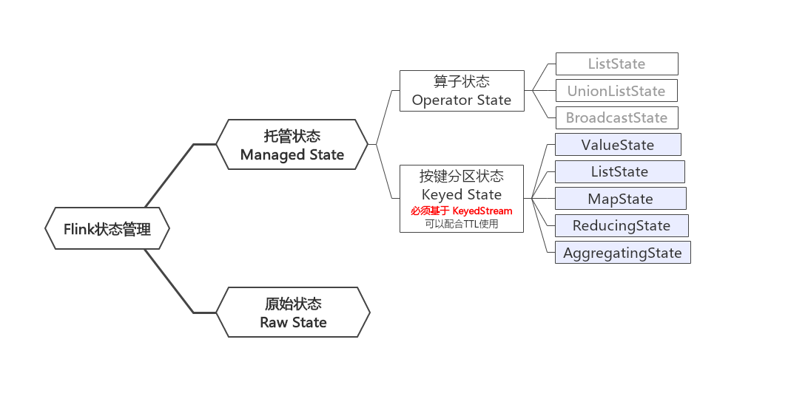
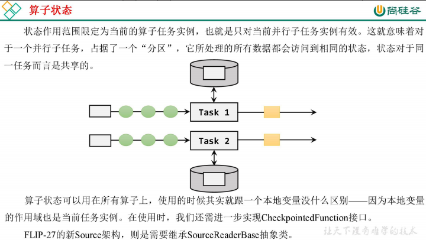
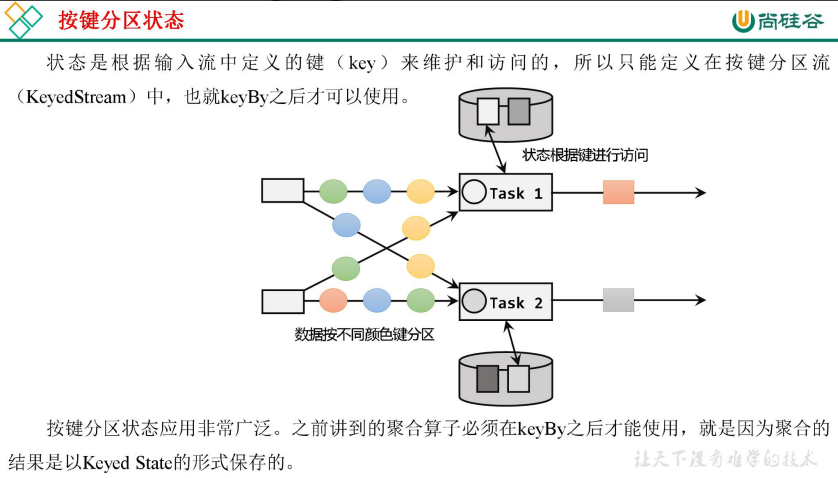
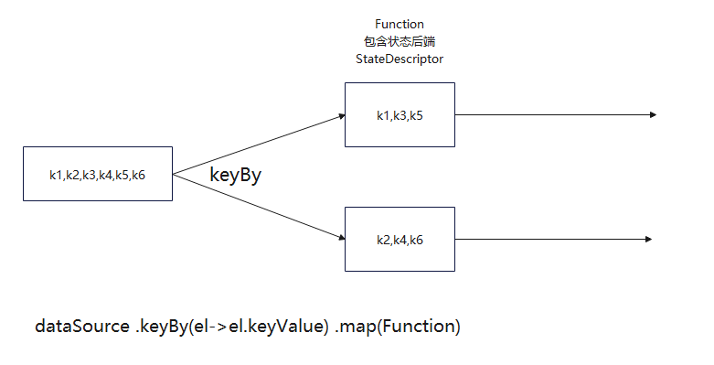

# 综述
FLink中算子任务可以分为**无状态**和**有状态** 两种情况，在有状态下出现了状态的分类。  
Flink 的状态有两种：托管状态（Managed State）和原始状态（Raw State）。托管状态就是由 Flink
统一管理的，状态的存储访问、故障恢复和重组等一系列问题都由 Flink 实现，我们只要调接口就可以；
而原始状态则是自定义的，相当于就是开辟了一块内存，需要我们自己管理，实现状态的序列化和故
障恢复。  
其中状态细分如下：  

## 两种托管状态

### 按键分区状态
其中按键分区状态（Keyed State）是我们常用的操作，需要注意，使用 Keyed State 必须基于 KeyedStream。没有进行 keyBy 分区的 DataStream，即使转
换算子实现了对应的富函数类，也不能通过运行时上下文访问 Keyed State。

总结如下：
1. 经过keyBy之后进入按键分区状态，相同的key会进入相同的分区状态处理逻辑（对应的算子）。但是同一个分区状态对应的算子可能有多个不同的key会进入。
2. 只能保障相同的key进入相同的按键分区状态，但是保障同一个按键分区状态只有一个key会进入。
 
eg1：6个不同的key在算子 2个并行度情况下，同一个按键分区状态会进入3个不同的key
eg2：6个不同的key在算子 1个并行度情况下，同一个按键分区状态会进入6个不同的key
eg3：6个不同的key在算子 6个并行度情况下，同一个按键分区状态只会进入1个不同的key
同一个按键分区状态保障了相同的key不会乱跑，但是由于资源有限可能会重复利用部分空间，具体需要看key的数据量和并行度。

部分数据流如下：

