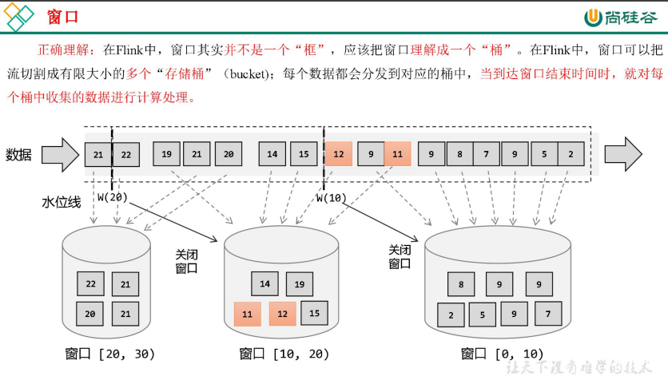

# 综述

Flink 是一种流式计算引擎，主要是来处理无界数据流的，数据源源不断、无穷无尽。想要更加方便高效地处理无界流，一种方式就是将无限数据切割成有限的“数据块”进行处理，这就是所谓的“窗口”（Window）。



**注意：**Flink 中窗口并不是静态准备好的，而是动态创建——当有落在这个窗口区间范围的数据达到时，才创建对应的窗口。另外，这里我们认为到达窗口结束时间时，窗口就触发计算并关闭，事实上“触发计算”和“窗口关闭”两个行为也可以分开，

# 窗口的分类

在 Flink 中，窗口的应用非常灵活，可以使用各种不同类型的窗口来实现需求


# 窗口函数

## 增量聚合函数（**ReduceFunction / AggregateFunction**）

窗口将数据收集起来，最基本的处理操作当然就是进行聚合。我们可以每来一个数据就在之前结果上聚合一次，这就是“增量聚合”。

### 归约函数（**ReduceFunction**）

```java
StreamExecutionEnvironment env = StreamExecutionEnvironment.getExecutionEnvironment();
env.setParallelism(1);
env.addSource(new WaterSensorSource())
        .keyBy(r -> r.getId())
        // 设置滚动事件时间窗口
        .window(TumblingProcessingTimeWindows.of(Time.seconds(10)))
        // 将 每来一个数据就在之前结果上聚合一次 合理利用cpu
        .reduce(new ReduceFunction<WaterSensor>() {
            @Override
            public WaterSensor reduce(WaterSensor value1, WaterSensor value2) throws Exception {
                System.out.println(" 调用reduce方法，之前的结果:" + value1 + ", 现在来的数据:" + value2);
                return new WaterSensor(value1.getId(), value1.getVc() + value2.getVc(), System.currentTimeMillis());
            }
        })
        .print();
env.execute();
```

### 聚合函数（**AggregateFunction**）

ReduceFunction 可以解决大多数归约聚合的问题，但是这个接口有一个限制，就是聚合状态的类型、**输出结果的类型都必须和输入数据类型一样**。

Flink Window API 中的 aggregate 就突破了这个限制，可以定义更加灵活的窗口聚合操作。这个方法需要传入一个 AggregateFunction 的实现类作为参数。


AggregateFunction 可以看作是 ReduceFunction 的通用版本，这里有三种类型：输入类型（IN）、累加器类型（ACC）和输出类型（OUT）。输入类型 IN 就是输入流中元素的数据类型；累加器类型 ACC则是我们进行聚合的中间状态类型；而输出类型当然就是最终计算结果的类型了。

接口中有四个方法：

- createAccumulator()：创建一个累加器，这就是为聚合创建了一个初始状态，每个聚合任务只会调用一次。

- add()：将输入的元素添加到累加器中。

- getResult()：从累加器中提取聚合的输出结果。

- merge()：合并两个累加器，并将合并后的状态作为一个累加器返回。

所以可以看到，AggregateFunction 的工作原理是：首先调用 createAccumulator()为任务初始化一个状态（累加器）；而后每来一个数据就调用一次 add()方法，对数据进行聚合，得到的结果保存在状态中；等到了窗口需要输出时，再调用 getResult()方法得到计算结果。很明显，与 ReduceFunction 相同，AggregateFunction 也是增量式的聚合；而由于输入、中间状态、输出的类型可以不同，使得应用更加灵活方便。

```java
StreamExecutionEnvironment env = StreamExecutionEnvironment.getExecutionEnvironment();
env.setParallelism(1);
SingleOutputStreamOperator<WaterSensor> sensorDS = env.addSource(new WaterSensorSource());

KeyedStream<WaterSensor, String> sensorKS = sensorDS.keyBy(WaterSensor::getId);
// 1. 窗口分配器
WindowedStream<WaterSensor, String, TimeWindow> sensorWS = sensorKS
        .window(TumblingProcessingTimeWindows.of(Time.seconds(10)));
SingleOutputStreamOperator<String> aggregate = sensorWS
        .aggregate(new AggregateFunction<WaterSensor, Integer, String>() {
                       @Override
                       public Integer createAccumulator() {
                           System.out.println("创建累加器");
                           return 0;
                       }

                       @Override
                       public Integer add(WaterSensor value, Integer accumulator) {
                           System.out.println(" 调 用 add 方法,value=" + value);
                           return accumulator + value.getVc();
                       }

                       @Override
                       public String getResult(Integer accumulator) {
                           System.out.println("调用 getResult 方法");
                           return accumulator.toString();
                       }

                       @Override
                       public Integer merge(Integer a, Integer b) {
                           System.out.println("调用 merge 方法");
                           return null;
                       }
                   }
        );
aggregate.print();
env.execute();
```

另 外 ， Flink 也 为 窗 口 的 聚 合 提 供 了 一 系 列 预 定 义 的 简 单 聚 合 方 法 ， 可 以 直 接 基 于WindowedStream 调用。主要包括 .sum()/max()/maxBy()/min()/minBy()，与 KeyedStream 的简单聚合非常相似。它们的底层，其实都是通过 AggregateFunction 来实现的。

## 全窗口函数（full window functions）

有些场景下，我们要做的计算必须基于全部的数据才有效，这时做增量聚合就没什么意义了；另外，输出的结果有可能要包含上下文中的一些信息（比如窗口的起始时间），这是增量聚合函数做不到的。

所以，我们还需要有更丰富的窗口计算方式。窗口操作中的另一大类就是全窗口函数。与增量聚合函数不同，全窗口函数需要先收集窗口中的数据，并在内部缓存起来，等到窗口要输出结果的时候再取出数据进行计算。

在 Flink 中，全窗口函数也有两种：WindowFunction 和 ProcessWindowFunction

### 窗口函数（WindowFunction）

WindowFunction 字面上就是“窗口函数”，它其实是老版本的通用窗口函数接口。我们可以基于WindowedStream 调用.apply()方法，传入一个 WindowFunction 的实现类。

```
stream
.keyBy(<key selector>)
.window(<window assigner>)
.apply(new MyWindowFunction());
```

这个类中可以获取到包含窗口所有数据的可迭代集合（Iterable），还可以拿到窗口（Window）本身的信息。

不过 WindowFunction 能提供的上下文信息较少，也没有更高级的功能。事实上，它的作用**可以被ProcessWindowFunction 全覆盖**，所以之后可能会**逐渐弃用**。

### 处理窗口函数（ProcessWindowFunction）

ProcessWindowFunction 是 Window API 中最底层的通用窗口函数接口。之所以说它“最底层”，是因为除了可以拿到窗口中的所有数据之外，ProcessWindowFunction 还可以获取到一个“上下文对象”（Context）。这个上下文对象非常强大，不仅能够获取窗口信息，还可以访问当前的时间和状态信息。

这里的时间就包括了处理时间（processing time）和事件时间水位线（event time watermark）。这就使得ProcessWindowFunction 更加灵活、功能更加丰富，其实就是一个增强版的 WindowFunction，ProcessWindowFunction 是 Flink 底层 API——处理函数（process function）中的一员。

```java
StreamExecutionEnvironment env = StreamExecutionEnvironment.getExecutionEnvironment();
env.setParallelism(1);
SingleOutputStreamOperator<WaterSensor> sensorDS = env.addSource(new WaterSensorSource());
KeyedStream<WaterSensor, String> sensorKS = sensorDS.keyBy(WaterSensor::getId);
// 1. 窗口分配器
WindowedStream<WaterSensor, String, TimeWindow> sensorWS = sensorKS
        .window(TumblingProcessingTimeWindows.of(Time.seconds(10)));
SingleOutputStreamOperator<String> process = sensorWS
        .process(
                new ProcessWindowFunction<WaterSensor, String, String, TimeWindow>() {
                    @Override
                    public void process(String s, Context context, Iterable<WaterSensor> elements, Collector<String> out) throws 							Exception {
                        long count = elements.spliterator().estimateSize();
                        long windowStartTs = context.window().getStart();
                        long windowEndTs = context.window().getEnd();
                        String windowStart = DateFormatUtils.format(windowStartTs, "yyyy-MM-dd HH:mm:ss.SSS");
                        String windowEnd = DateFormatUtils.format(windowEndTs, "yyyy-MM-dd HH:mm:ss.SSS");
                        out.collect("key=" + s + " 的 窗 口 [" + windowStart + "," + windowEnd + ") 包 含 " + count + " 条 数 据 								===>" + elements.toString());
                    }
                }
        );
process.print();
env.execute();
```

## 增量聚合和全窗口函数的结合使用

在实际应用中，我们往往希望兼具这两者的优点，把它们结合在一起使用。Flink 的 Window API就给我们实现了这样的用法。我们之前在调用 WindowedStream 的.reduce()和.aggregate()方法时，只是简单地直接传入了一个ReduceFunction 或 AggregateFunction 进行增量聚合。除此之外，其实还可以传入第二个参数：一个全窗口函数，可以是 WindowFunction 或者 ProcessWindowFunction。

```java
// ReduceFunction 与 WindowFunction 结合
public <R> SingleOutputStreamOperator<R> reduce
    (ReduceFunction<T> reduceFunction ， WindowFunction<T ， R ， K ， W> function)
    
// ReduceFunction 与 ProcessWindowFunction 结合
public <R> SingleOutputStreamOperator<R> reduce
    (ReduceFunction<T> reduceFunction，ProcessWindowFunction<T，R，K，W> function)

// AggregateFunction 与 WindowFunction 结合
public <ACC，V，R> SingleOutputStreamOperator<R> aggregate
    (AggregateFunction<T，ACC，V> aggFunction，WindowFunction<V，R，K，W> windowFunction)

// AggregateFunction 与 ProcessWindowFunction 结合
public <ACC，V，R> SingleOutputStreamOperator<R> aggregate
    (AggregateFunction<T，ACC，V> aggFunction,ProcessWindowFunction<V，R，K，W> windowFunction)
```

这样调用的处理机制是：基于第一个参数（增量聚合函数）来处理窗口数据，每来一个数据就做一次聚合；等到窗口需要触发计算时，则调用第二个参数（全窗口函数）的处理逻辑输出结果。需要注意的是，这里的全窗口函数就不再缓存所有数据了，而是直接将增量聚合函数的结果拿来当作了Iterable 类型的输入。

完整代码如下：

```java
public class WindowAggregateAndProcessDemo {
    public static void main(String[] args) throws Exception {
        StreamExecutionEnvironment env = StreamExecutionEnvironment.getExecutionEnvironment();
        env.setParallelism(1);

        SingleOutputStreamOperator<WaterSensor> sensorDS = env.addSource(new WaterSensorSource());
        KeyedStream<WaterSensor, String> sensorKS = sensorDS.keyBy(sensor -> sensor.getId());
        // 1. 窗口分配器
        WindowedStream<WaterSensor, String, TimeWindow> sensorWS =
                sensorKS.window(TumblingProcessingTimeWindows.of(Time.seconds(10)));
        // 2. 窗口函数：
        /**
         * 增量聚合 Aggregate + 全窗口 process
         * 1、增量聚合函数处理数据： 来一条计算一条
         * 2、窗口触发时， 增量聚合的结果（只有一条） 传递给 全窗口函数
         * 3、经过全窗口函数的处理包装后，输出
         *
         * 结合两者的优点：
         * 1、增量聚合： 来一条计算一条，存储中间的计算结果，占用的空间少
         * 2、全窗口函数： 可以通过 上下文 实现灵活的功能
         */
        // sensorWS.reduce() //也可以传两个
        SingleOutputStreamOperator<String> result = sensorWS.aggregate(
                new MyAgg(),
                new MyProcess()
        );
        result.print();
        env.execute();
    }

    public static class MyAgg implements AggregateFunction<WaterSensor, Integer, String> {
        @Override
        public Integer createAccumulator() {
            System.out.println("创建累加器");
            return 0;
        }

        @Override
        public Integer add(WaterSensor value, Integer accumulator) {
            System.out.println("调用 add 方法,value=" + value);
            return accumulator + value.getVc();
        }

        @Override
        public String getResult(Integer accumulator) {
            System.out.println("调用 getResult 方法");
            return accumulator.toString();
        }

        @Override
        public Integer merge(Integer a, Integer b) {
            System.out.println("调用 merge 方法");
            return null;
        }
    }

    // 全窗口函数的输入类型 = 增量聚合函数的输出类型
    public static class MyProcess extends ProcessWindowFunction<String, String, String, TimeWindow> {
        @Override
        public void process(String s, Context context, Iterable<String> elements, Collector<String> out) throws Exception {
            long startTs = context.window().getStart();
            long endTs = context.window().getEnd();
            String windowStart = DateFormatUtils.format(startTs, "yyyy-MM-dd HH:mm:ss.SSS");
            String windowEnd = DateFormatUtils.format(endTs, "yyyy-MM-dd HH:mm:ss.SSS");
            long count = elements.spliterator().estimateSize();
            out.collect("key=" + s + " 的 窗 口 [" + windowStart + "," + windowEnd + ")包含" + count + "条数据===>" + elements.toString());
        }
    }
}
```

## 其他API

### 触发器（Trigger）

触发器主要是用来控制窗口什么时候触发计算。所谓的“触发计算”，本质上就是执行窗口函数，所以可以认为是计算得到结果并输出的过程。基于 WindowedStream 调用.trigger()方法，就可以传入一个自定义的窗口触发器（Trigger）。

```
stream.keyBy(...)
.window(...)
.trigger(new MyTrigger())
```

### 移除器（Evictor）

移除器主要用来定义移除某些数据的逻辑。基于 WindowedStream 调用.evictor()方法，就可以传入一个自定义的移除器（Evictor）。Evictor 是一个接口，不同的窗口类型都有各自预实现的移除器。

```
stream.keyBy(...)
.window(...)
.evictor(new MyEvictor())
```

# 时间语义


在 Flink 中，用来衡量事件时间进展的标记，就被称作“水位线”（Watermark）

# 水位线

在 Flink 的 DataStream API 中 ， 有一个单独用于生成水位线的方法：.assignTimestampsAndWatermarks()，它主要用来为流中的数据分配时间戳，并生成水位线来指示事件时间。具体使用如下：

```java
DataStream<Event> withTimestampsAndWatermarks =stream.assignTimestampsAndWatermarks(<watermark strategy>);
```

说明：WatermarkStrategy 作为参数，这就是所谓的“水位线生成策略”。WatermarkStrategy 是一个接 口 ， 该 接 口 中 包 含 了 一 个 “ 时 间 戳 分 配 器 ” TimestampAssigner 和 一 个 “ 水 位 线 生 成 器 ”WatermarkGenerator。

```java
public interface WatermarkStrategy<T> extends TimestampAssignerSupplier<T>, WatermarkGeneratorSupplier<T>{

    // 负责从流中数据元素的某个字段中提取时间戳，并分配给元素。时间戳的分配是生成水位线的基础。
    @Override
    TimestampAssigner<T> createTimestampAssigner(TimestampAssignerSupplier.Context context);
    
    // 主要负责按照既定的方式，基于时间戳生成水位线
    @Override
    WatermarkGenerator<T> createWatermarkGenerator(WatermarkGeneratorSupplier.Context context);
}
```

## FLink内置水位线

### **有序流中内置水位线设置**

对于有序流，主要特点就是时间戳单调增长，所以永远不会出现迟到数据的问题。这是周期性生成水位线的最简单的场景，直接调用 **WatermarkStrategy.forMonotonousTimestamps()**方法就可以实现。

```java
StreamExecutionEnvironment env = StreamExecutionEnvironment.getExecutionEnvironment();
env.setParallelism(1);
DataStreamSource<WaterSensor> dataSource = env.addSource(new WaterSensorSource());
// 有序流中内置水位线设置
// 1. 设置有序水位线策略
// WatermarkStrategy.forMonotonousTimestamps()
WatermarkStrategy<WaterSensor> watermarkStrategy = WatermarkStrategy
        // 使用有序流的升序水位线
        .<WaterSensor>forMonotonousTimestamps()
        // 指定时间戳分配器，从数据中提取
        .withTimestampAssigner((SerializableTimestampAssigner<WaterSensor>) (element, recordTimestamp) -> element.getTs());
// 2. 指定Watermark策略
SingleOutputStreamOperator<WaterSensor> sensorDSWithWatermark = dataSource.assignTimestampsAndWatermarks(watermarkStrategy);

// 3. 使用 事件时间语义 窗口
sensorDSWithWatermark.keyBy(WaterSensor::getId)
        // 滚动 事件时间 窗口
        .window(TumblingEventTimeWindows.of(Time.minutes(3)))
        // 获取窗口内结果，生成使用时可以世界 addSink 输出，此处只是为了方便显示结果
        .process(
                new ProcessWindowFunction<WaterSensor, String, String, TimeWindow>() {
                    @Override
                    public void process(String s, Context context, Iterable<WaterSensor> elements, Collector<String> out) throws Exception {
                        long startTs = context.window().getStart();
                        long endTs = context.window().getEnd();
                        String windowStart = DateFormatUtils.format(startTs, "yyyy-MM-dd HH:mm:ss.SSS");
                        String windowEnd = DateFormatUtils.format(endTs, "yyyy-MM-dd HH:mm:ss.SSS");
                        long count = elements.spliterator().estimateSize();
                        out.collect("key=" + s + "的窗口[" + windowStart + "," + windowEnd + ")包含" + count + "条数据===>" + elements.toString());
                    }
                }
        )
        // 打印最终结果
        .print();

env.execute();
```

### 乱序流中内置水位线设置

由于乱序流中需要等待迟到数据到齐，所以必须设置一个固定量的延迟时间。这时生成水位线的时间戳，就是当前数据流中最大的时间戳减去延迟的结果，相当于把表调慢，当前时钟会滞后于数据的最大时间戳。调用 **WatermarkStrategy. forBoundedOutOfOrderness()**方法就可以实现。这个方法需要传入一个 axOutOfOrderness 参数，表示“最大乱序程度”，它表示数据流中乱序数据时间戳的最大差值；如果我们能确定乱序程度，那么设置对应时间长度的延迟，就可以等到所有的乱序数据了。

```java
StreamExecutionEnvironment env = StreamExecutionEnvironment.getExecutionEnvironment();
env.setParallelism(1);
DataStreamSource<WaterSensor> dataSource = env.addSource(new WaterSensorSource());
// 乱序流中内置水位线设置
// 1. 设置乱序水位线策略
// WatermarkStrategy.forMonotonousTimestamps()
WatermarkStrategy<WaterSensor> watermarkStrategy = WatermarkStrategy
        // 使用乱序流的升序水位线，等待 3 s
        .<WaterSensor>forBoundedOutOfOrderness(Duration.ofSeconds(3))
        // 指定时间戳分配器，从数据中提取
        .withTimestampAssigner((SerializableTimestampAssigner<WaterSensor>) (element, recordTimestamp) -> element.getTs());
// 2. 指定Watermark策略
SingleOutputStreamOperator<WaterSensor> sensorDSWithWatermark = dataSource.assignTimestampsAndWatermarks(watermarkStrategy);

// 3. 使用 事件时间语义 窗口
sensorDSWithWatermark.keyBy(WaterSensor::getId)
        // 滚动 事件时间 窗口
        .window(TumblingEventTimeWindows.of(Time.minutes(3)))
        // 获取窗口内结果，生成使用时可以世界 addSink 输出，此处只是为了方便显示结果
        .process(
                new ProcessWindowFunction<WaterSensor, String, String, TimeWindow>() {
                    @Override
                    public void process(String s, Context context, Iterable<WaterSensor> elements, Collector<String> out) throws Exception {
                        long startTs = context.window().getStart();
                        long endTs = context.window().getEnd();
                        String windowStart = DateFormatUtils.format(startTs, "yyyy-MM-dd HH:mm:ss.SSS");
                        String windowEnd = DateFormatUtils.format(endTs, "yyyy-MM-dd HH:mm:ss.SSS");
                        long count = elements.spliterator().estimateSize();
                        out.collect("key=" + s + "的窗口[" + windowStart + "," + windowEnd + ")包含" + count + "条数据===>" + elements.toString());
                    }
                }
        )
        // 打印最终结果
        .print();

env.execute();
```

## 自定义水位线生成

### 周期性水位线生成器（Periodic Generator）

周期性生成器一般是通过 onEvent()观察判断输入的事件，而在 onPeriodicEmit()里发出水位线。

```java
public static void main(String[] args) throws Exception {

    StreamExecutionEnvironment env = StreamExecutionEnvironment.getExecutionEnvironment();
    env
            .addSource(new WaterSensorSource())
            .assignTimestampsAndWatermarks(new CustomWatermarkStrategy())
            .print();
    env.execute();
}

public static class CustomWatermarkStrategy implements WatermarkStrategy<WaterSensor> {
    @Override
    public TimestampAssigner<WaterSensor> createTimestampAssigner(TimestampAssignerSupplier.Context context) {
        return new SerializableTimestampAssigner<WaterSensor>() {
            @Override
            public long extractTimestamp(WaterSensor element, long recordTimestamp) {
                return element.getTs(); // 告诉程序数据源里的时间戳是哪一个字段
            }
        };
    }

    @Override
    public WatermarkGenerator<WaterSensor> createWatermarkGenerator(WatermarkGeneratorSupplier.Context context) {
        return new CustomBoundedOutOfOrdernessGenerator();
    }
}

public static class CustomBoundedOutOfOrdernessGenerator implements WatermarkGenerator<WaterSensor> {
    private Long delayTime = 5000L; // 延迟时间
    private Long maxTs = -Long.MAX_VALUE + delayTime + 1L; // 观察到的最大时间戳

    @Override
    public void onEvent(WaterSensor event, long eventTimestamp, WatermarkOutput output) {
        // 每来一条数据就调用一次
        maxTs = Math.max(event.getTs(), maxTs); // 更新最大时间戳
    }

    @Override
    public void onPeriodicEmit(WatermarkOutput output) {
        // 发射水位线，默认 200ms 调用一次
        output.emitWatermark(new Watermark(maxTs - delayTime - 1L));
    }
}
```

我们在 onPeriodicEmit()里调用 output.emitWatermark()，就可以发出水位线了；这个方法由系统框架周期性地调用，默认 200ms 一次。

如果想修改默认周期时间，可以通过下面方法修改。例如：修改为 400ms

```java
env.getConfig().setAutoWatermarkInterval(400L);
```

### 断点式水位线生成器（Punctuated Generator）

断点式生成器会不停地检测 onEvent()中的事件，当发现带有水位线信息的事件时，就立即发出水位线。我们把发射水位线的逻辑写在 onEvent 方法当中即可。

### 在数据源中发送水位线

我们也可以在自定义的数据源中抽取事件时间，然后发送水位线。这里要注意的是，在自定义数

据源中发送了水位线以后，就不能再在程序中使用 assignTimestampsAndWatermarks 方法来生成水位线

了。在自定义数据源中生成水位线和在程序中使用 assignTimestampsAndWatermarks 方法生成水位线二

者只能取其一。示例程序如下：

```
env.fromSource(kafkaSource,WatermarkStrategy.forBoundedOutOfOrderness(Duration.ofSeconds(3)),"kafkasource")
```

### 水位线的传递

在流处理中，上游任务处理完水位线、时钟改变之后，要把当前的水位线再次发出，广播给所有的下游子任务。而当一个任务接收到多个上游并行任务传递来的水位线时，应该**以最小的那个作为当前任务的事件时钟**。

如果实践中遇见 在多个上游并行任务中，如果有其中一个没有数据，由于当前 Task 是以最小的那个作为当前任务的事件时钟，就会导致当前 Task 的水位线无法推进，就可能导致窗口无法触发。这时候可以设置空闲等待。

```java
WatermarkStrategy.<Integer>forMonotonousTimestamps()
.withTimestampAssigner((r, ts) -> r *1000L)
// 空闲等待 5s
.withIdleness(Duration.ofSeconds(5)) 
```

## 迟到数据处理

### 推迟水印推进

在水印产生时，设置一个乱序容忍度，推迟系统时间的推进，保证窗口计算被延迟执行，为乱序的数据争取更多的时间进入窗口。

```java
WatermarkStrategy.forBoundedOutOfOrderness(Duration.ofSeconds(10));
```

### 设置窗口延迟关闭

Flink 的窗口，也允许迟到数据。当触发了窗口计算后，会先计算当前的结果，但是此时并不会关闭窗口。

以后每来一条迟到数据，就触发一次这条数据所在窗口计算(增量计算)。直到 wartermark 超过了窗口结束时间+推迟时间，此时窗口会真正关闭。

```java
.window(TumblingEventTimeWindows.of(Time.seconds(5)))
.allowedLateness(Time.seconds(3))
```

注意: 允许迟到只能运用在 event time 上

### 使用侧流接收迟到的数据

```java
.windowAll(TumblingEventTimeWindows.of(Time.seconds(5)))
.allowedLateness(Time.seconds(3))
.sideOutputLateData(lateWS)
```

完整案例代码如下：

```java
StreamExecutionEnvironment env = StreamExecutionEnvironment.getExecutionEnvironment();
env.setParallelism(1);
SingleOutputStreamOperator<WaterSensor> sensorDS = env.socketTextStream("192.168.31.200", 7777).map(new WaterSensorMapFunction());
WatermarkStrategy<WaterSensor> watermarkStrategy = WatermarkStrategy.<WaterSensor>forBoundedOutOfOrderness(Duration.ofSeconds(3)).withTimestampAssigner((element, recordTimestamp) -> element.getTs() * 1000L);

SingleOutputStreamOperator<WaterSensor> sensorDSWithWatermark = sensorDS.assignTimestampsAndWatermarks(watermarkStrategy);
OutputTag<WaterSensor> lateTag = new OutputTag<>("late-data", Types.POJO(WaterSensor.class));
SingleOutputStreamOperator<String> process = sensorDSWithWatermark.keyBy(WaterSensor::getId)
        .window(TumblingEventTimeWindows.of(Time.seconds(10))).allowedLateness(Time.seconds(2)) // 推迟 2s 关窗
        .sideOutputLateData(lateTag) // 关窗后的迟到数据，放入侧输出流
        .process(new ProcessWindowFunction<WaterSensor, String, String, TimeWindow>() {
            @Override
            public void process(String s, Context context, Iterable<WaterSensor> elements, Collector<String> out) throws Exception {
                long startTs = context.window().getStart();
                long endTs = context.window().getEnd();
                String windowStart = DateFormatUtils.format(startTs, "yyyy-MM-dd HH:mm:ss.SSS");
                String windowEnd = DateFormatUtils.format(endTs, "yyyy-MM-dd HH:mm:ss.SSS");
                long count = elements.spliterator().estimateSize();
                out.collect("key=" + s + "的窗口[" + windowStart + "," + windowEnd + ") 包 含 " + count + " 条 数 据 ===>" + elements.toString());
            }
        });
process.print();
// 从主流获取侧输出流，打印
process.getSideOutput(lateTag).printToErr("关窗后的迟到数据");
env.execute();
```

## 基于时间的合流——双流联结（Join）

### 窗口联结（Window Join）

窗口联结在代码中的实现，首先需要调用 DataStream 的.join()方法来合并两条流，得到一个JoinedStreams；接着通过.where()和.equalTo()方法指定两条流中联结的 key；然后通过.window()开窗口，并调用.apply()传入联结窗口函数进行处理计算。通用调用形式如下：

```java
stream1.join(stream2)
.where(<KeySelector>)
.equalTo(<KeySelector>)
.window(<WindowAssigner>)
.apply(<JoinFunction>)
```

完整代码

```java
public class WindowJoinDemo {
    public static void main(String[] args) throws Exception {
        StreamExecutionEnvironment env = StreamExecutionEnvironment.getExecutionEnvironment();
        env.setParallelism(1);
        SingleOutputStreamOperator<Tuple2<String, Integer>> ds1 = env.fromElements(
                        Tuple2.of("a", 1),
                        Tuple2.of("a", 2),
                        Tuple2.of("b", 1),
                        Tuple2.of("c", 1)
                )
                .assignTimestampsAndWatermarks(WatermarkStrategy
                        .<Tuple2<String, Integer>>forMonotonousTimestamps()
                        .withTimestampAssigner((value, ts) -> value.f1 * 1000L)
                );
        SingleOutputStreamOperator<Tuple3<String, Integer, Integer>> ds2 = env.fromElements(
                Tuple3.of("a", 1, 1),
                Tuple3.of("a", 4, 1),
                Tuple3.of("a", 11, 1),
                Tuple3.of("b", 2, 1),
                Tuple3.of("b", 12, 1),
                Tuple3.of("c", 14, 1),
                Tuple3.of("d", 15, 1)
        ).assignTimestampsAndWatermarks(WatermarkStrategy
                .<Tuple3<String, Integer, Integer>>forMonotonousTimestamps()
                .withTimestampAssigner((value, ts) -> value.f1 * 1000L)
        );

        // windows join
        // 1. 落在同一个时间窗口范围内才能匹配上
        // 2. 根据keyBy的key，来进行数据匹配
        // 3. 只能拿到匹配上的数据，类似inner join
        DataStream<String> joinResult = ds1.join(ds2)
                .where(r1 -> r1.f0)
                .equalTo(r2 -> r2.f0)
                .window(TumblingEventTimeWindows.of(Time.seconds(5)))
                .apply(new JoinFunction<Tuple2<String, Integer>, Tuple3<String, Integer, Integer>, String>() {
                    @Override
                    public String join(Tuple2<String, Integer> first, Tuple3<String, Integer, Integer> second) throws Exception {
                        return first + "<----->" + second;
                    }
                });
        joinResult.print("windows join");


        // interval join
        // 1. 分别做keyBy key其实就是关联关系
        KeyedStream<Tuple2<String, Integer>, String> ks1 = ds1.keyBy(r1 -> r1.f0);
        KeyedStream<Tuple3<String, Integer, Integer>, String> ks2 = ds2.keyBy(r2 -> r2.f0);
        // 2. 调用interval join
       ks1.intervalJoin(ks2)
                .between(Time.seconds(-2), Time.seconds(1))
                .process(
                        new ProcessJoinFunction<Tuple2<String, Integer>, Tuple3<String, Integer, Integer>, String>() {
                            @Override
                            public void processElement(Tuple2<String, Integer> left, Tuple3<String, Integer, Integer> right, ProcessJoinFunction<Tuple2<String, Integer>, Tuple3<String, Integer, Integer>, String>.Context ctx, Collector<String> out) throws Exception {
                                out.collect(left + "<=======>" + right);
                            }
                        }).print("   interval join  ");

        env.execute();
    }
}
```

### 间隔联结（Interval Join）


通用调用形式如下：

```java
stream1
.keyBy(<KeySelector>)
.intervalJoin(stream2.keyBy(<KeySelector>))
.between(Time.milliseconds(-2), Time.milliseconds(1))
.process (new ProcessJoinFunction<Integer, Integer, String(){
    @Override
    public void processElement(Integer left, Integer right, Context ctx, Collector<String> out) {
        out.collect(left + "," + right);
    }
});
```

完整代码：

```java
public class IntervalJoinDemo {
    public static void main(String[] args) throws Exception {
        StreamExecutionEnvironment env = StreamExecutionEnvironment.getExecutionEnvironment();
        env.setParallelism(1);
        SingleOutputStreamOperator<Tuple2<String, Integer>> ds1 = env
                .fromElements(
                        Tuple2.of("a", 1),
                        Tuple2.of("a", 2),
                        Tuple2.of("b", 3),
                        Tuple2.of("c", 4)
                )
                .assignTimestampsAndWatermarks(
                        WatermarkStrategy
                                .<Tuple2<String, Integer>>forMonotonousTimestamps()
                                .withTimestampAssigner((value, ts) -> value.f1 * 1000L)
                );
        SingleOutputStreamOperator<Tuple3<String, Integer, Integer>> ds2 =
                env
                        .fromElements(
                                Tuple3.of("a", 1, 1),
                                Tuple3.of("a", 11, 1),
                                Tuple3.of("b", 2, 1),
                                Tuple3.of("b", 12, 1),
                                Tuple3.of("c", 14, 1),
                                Tuple3.of("d", 15, 1)
                        )
                        .assignTimestampsAndWatermarks(
                                WatermarkStrategy.<Tuple3<String, Integer, Integer>>forMonotonousTimestamps()
                                        .withTimestampAssigner((value, ts) -> value.f1 * 1000L)
                        );
        // TODO interval join
        // 1. 分别做 keyby，key 其实就是关联条件
        KeyedStream<Tuple2<String, Integer>, String> ks1 = ds1.keyBy(r1 -> r1.f0);
        KeyedStream<Tuple3<String, Integer, Integer>, String> ks2 = ds2.keyBy(r2 -> r2.f0);
        // 2. 调用 interval join
        ks1.intervalJoin(ks2)
                .between(Time.seconds(-2), Time.seconds(2))
                .process(
                        new ProcessJoinFunction<Tuple2<String, Integer>,
                                Tuple3<String, Integer, Integer>, String>() {
                            /**
                             * 两条流的数据匹配上，才会调用这个方法
                             * @param left ks1 的数据
                             * @param right ks2 的数据
                             * @param ctx 上下文
                             * @param out 采集器
                             * @throws Exception
                             */
                            @Override
                            public void processElement(Tuple2<String,
                                    Integer> left, Tuple3<String, Integer, Integer> right, Context ctx,
                                                       Collector<String> out) throws Exception {
                                // 进入这个方法，是关联上的数据
                                out.collect(left + "<------>" + right);
                            }
                        })
                .print();
        env.execute();
    }
}
```

