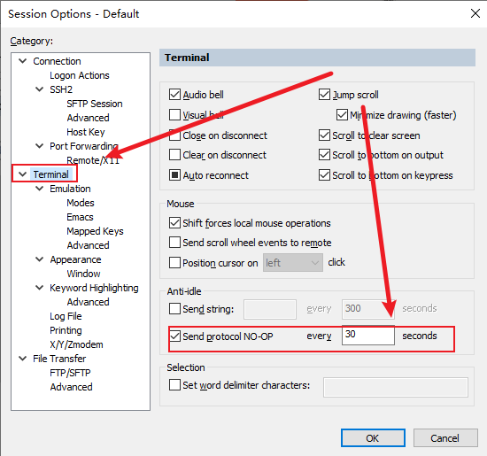
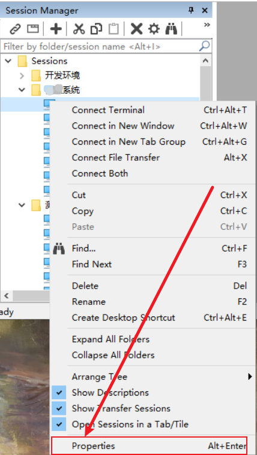
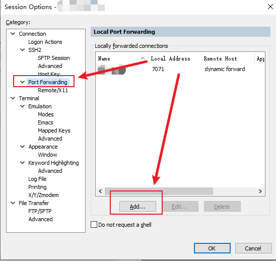
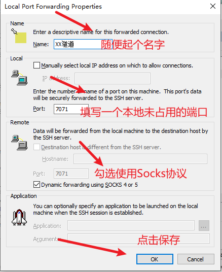
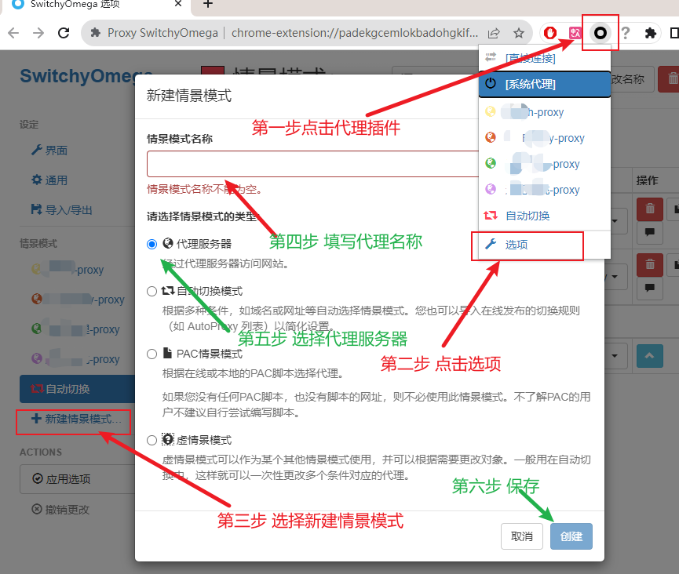
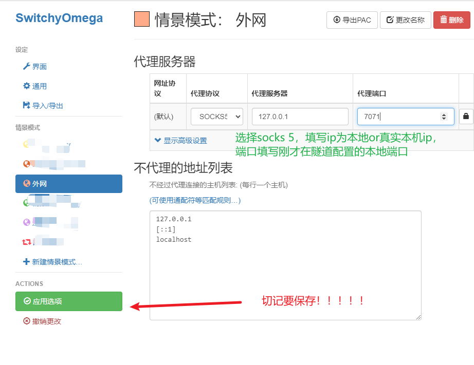
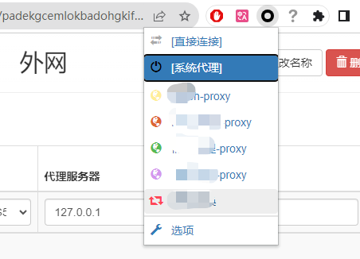

# 配置空闲不断开
在某些默认的环境下，使用CRT连接服务器，如果一段时间内不操作连接会自动断开，需要进行设置  

Options->Session Options->Terminal->Anti-idle->勾选Send protocol NO-OP

# 当做sockets隧道使用
在一些线上生产环境中需要通过跳板机连接到真正的生产服务器进行操作，但是在大数据的场景下很多时候需要访问生产环境的一个webUI
比如：CDH的Cloudera Manager，Flink的WebUI等，如果运维不提供相关的代理，可以通过SecureCRT的ssh隧道进行连接。

使用 SecureCRT的ssh隧道 进行连接 默认跳板机可以访问 生产环境的WebUI。

## 使用工具
SecureCRT + 浏览器插件[SwitchyOmega](https://chrome.google.com/webstore/detail/proxy-switchyomega/padekgcemlokbadohgkifijomclgjgif)

### 第一步：  
使用 SecureCRT 连接到跳板机

### 第二步：  
选择连接，右键属性  

选择 Connection=>PortForwarding=>单击Add 进行新增  

1. 随便给隧道起个名字
2. 填写一个本地未占用的端口（之后这个端口用来做本地的隧道口）
3. 建议使用socks协议，也可以使用自定义的http协议
4. 点击保存  

### 第三步：
重新开启这个SecureCRT的连接，SSH隧道就可以使用了。
此时可以配置系统的代理到这个端口 eg：127.0.0.1:7071

### 第四步（可选）：
使用单纯的浏览器插件可以只在浏览器上使用这个代理，而不影响系统的全局网络，同时，通过浏览器插件也可以快速的切换到代理，不需要频繁的修改系统的代理。

建议使用浏览器插件：[SwitchyOmega](https://chrome.google.com/webstore/detail/proxy-switchyomega/padekgcemlokbadohgkifijomclgjgif)

**非Chrome内核浏览器请出门，然后把门带上。**

最后点击插件，选择配置好的代理，单击选择后，就可以使用了  

最后，记得，不用的时候关闭插件，或者，切换到系统代理。

同时 这个插件还有好多好玩的功能，请自行研究。
