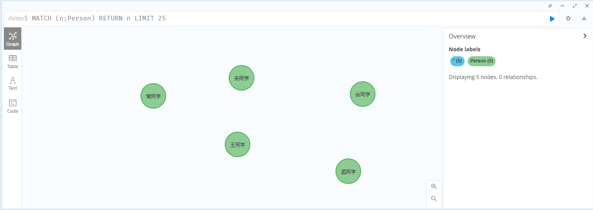

```shell
# 查询所有节点及其关系：
MATCH (n)-[r]->() RETURN n, r
# 查询所有节点及其关系，并限制返回数量
MATCH (n)-[r]->()
RETURN n, r
LIMIT 10
```
数据库相关操作
```shell
# 创建数据库(这个命令必须在system库下执行才可以)
CREATE DATABASE name
# 删除数据库
DROP  DATABASE name
# 启动一个被停止的数据库
START DATABASE name
# 停止一个数据库
STOP DATABASE name
# 查看一个特殊的数据库状态
SHOW DATABASE name
# 查看默认数据库的状态和名字
SHOW DEFAULT DATABASE 
```
# 创建节点
```shell
# 创建任务节点
CREATE (n:Person {name:'常同学'}) RETURN n;
CREATE (n:Person {name:'王同学'}) RETURN n;   
CREATE (n:Person {name:'孟同学'}) RETURN n;
CREATE (n:Person {name:'台同学'}) RETURN n;
CREATE (n:Person {name:'朱同学'}) RETURN n;

# 删除节点
MATCH (n:Person {name:'朱同学'}) DELETE n;
```
CREATE是创建操作，Person是标签，代表节点的类型。花括号{}代表节点的属性，属性类似Python的字典。这条语句的含义就是创建一个标签为Person的节点，该节点具有一个name属性，属性值是常同学。

```shell
# 创建地区节点
CREATE (n:Location {city:'河南'});
CREATE (n:Location {city:'河北'});
CREATE (n:Location {city:'阿拉善'});
CREATE (n:Location {city:'山东'});
# 删除节点
MATCH (n:Location {city:'河南'}) DELETE n;
```

# 创建关系
```shell
# 创建关系
MATCH (a:Person {name:'常同学'}),(b:Location {city:'河南'}) MERGE (a)-[r:出生地]->(b)
# 查询关系
MATCH p=()-[r:`出生地`]->() RETURN p LIMIT 25
```
这里面的方括号[]里面是关系，出生地就是类型。这里面有箭头 -->的方向的，表示是从a到b的关系。如上图所示可以明显看出来。

关系也可以增加属性值
```shell
MATCH (a:Person {name:'常同学'}),(b:Location {city:'河南'}) MERGE (a)-[:出生地 {since:2001}]->(b)
```


创建更多的关系
```shell
命令：
MATCH (a:Person {name:'常同学'}), (b:Person {name:'朱同学'}) MERGE (a)-[r:同学]->(b);
MATCH (a:Person {name:'常同学'}), (b:Person {name:'王同学'}) MERGE (a)-[r:同学]->(b);
MATCH (a:Person {name:'朱同学'}), (b:Person {name:'台同学'}) MERGE (a)-[r:同学]->(b);
MATCH (a:Person {name:'台同学'}), (b:Person {name:'孟同学'}) MERGE (a)-[r:同学]->(b);
```


建立多个人物与地区的关系
```shell
命令：
MATCH (a:Person {name:'常同学'}), (b:Location {city:'河南'}) MERGE (a)-[:出生地]->(b);
MATCH (a:Person {name:'朱同学'}), (b:Location {city:'河南'}) MERGE (a)-[:出生地]->(b);
MATCH (a:Person {name:'王同学'}), (b:Location {city:'阿拉善'}) MERGE (a)-[:出生地]->(b);
MATCH (a:Person {name:'台同学'}), (b:Location {city:'河北'}) MERGE (a)-[:出生地]->(b);
MATCH (a:Person {name:'孟同学'}), (b:Location {city:'山东'}) MERGE (a)-[:出生地]->(b);
```


查询  插入数据已经完成，现在就开始查询。
```shell
命令：MATCH (a:Person)-[r:出生地]->(b:Location {city:'河南'}) RETURN a,b
```


查询所有对外有关系的节点，以及关系类型
```shell
MATCH (a)-[r]->() RETURN a.name, type(r)
```


创建节点的时候就建立好关系
```shell
CREATE (a:Person {name:'苗同学'})-[r:朋友]->(b:Person {name:'叶同学'})
```


```shell
# 增加修改节点的属性：
MATCH (a:Person {name:'常同学'}) SET a.age=20

# 查询指定数量插入的数据
MATCH (n:标签名) RETURN n LIMIT 25

# 查询数据中title=“ XX” 的节点
MATCH (n:HudongItem{title:'菊糖'}) return n; 带节点的
MATCH (n{title:'菊糖'}) return n;  不带节点的

# 查询库中所有关系的数量
MATCH ()-[r]->() return COUNT(r);

# 查询库中所有node(节点)数量
MATCH (node) RETURN count(node)

#删除指定关系
MATCH (a:Person)-[r:出生地]-(a:Person) DELETE r

#删除节点
MATCH (a:Person {name:'河南'}) DELETE a

#删除标签
MATCH (r:Location) detach delete r

#删除节点属性
MATCH (a:Person {name:'常同学'}) SET a.age=20
```
# 界面操作技巧

